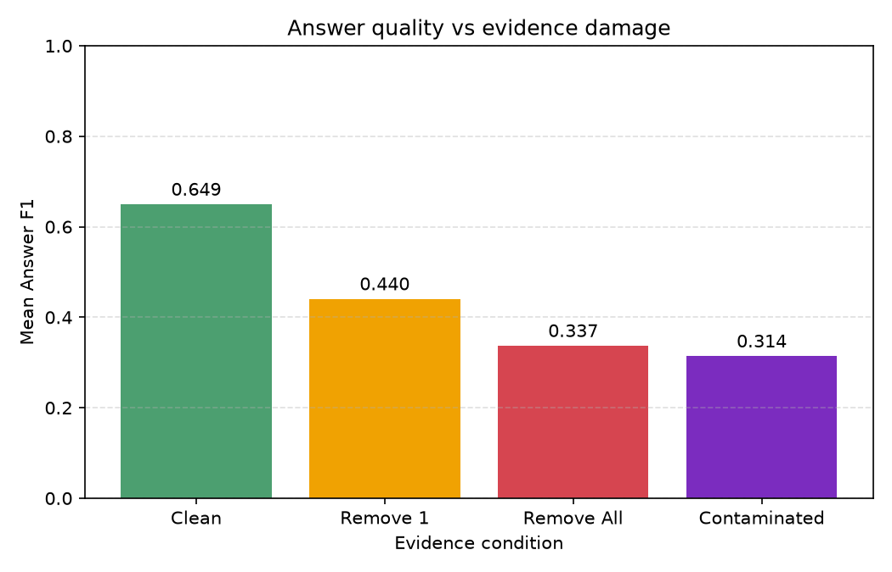
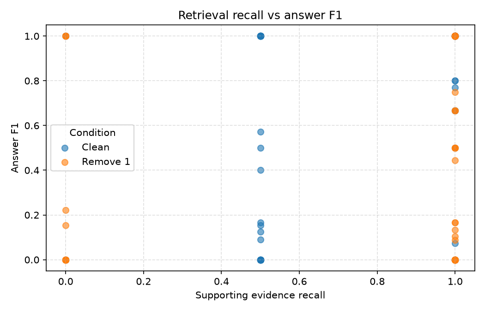
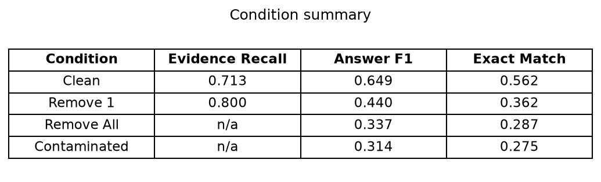

# RAG Evidence Corruption Stress Test

How much does a RAG system's answer quality depend on the evidence it is
given? We damaged the evidence in controlled ways and measured what happened.

## 1. The problem

RAG (Retrieval-Augmented Generation) systems answer questions in two steps:
first they *retrieve* relevant documents, then they *generate* an answer based
on those documents. If the retrieval step brings back incomplete or misleading
documents, how much does the final answer suffer? We wanted to measure this,
not just assume it.

## 2. The research question

> How does RAG answer reliability change as supporting evidence is
> progressively removed or replaced with distractor evidence?

A second, smaller question: how closely does retrieval quality track final
answer quality?

## 3. Experimental setup

```text
HotpotQA questions (80 hard-level questions)
        ↓
Build a small per-question corpus (10 paragraphs each)
        ↓
Damage the evidence in 4 controlled ways
        ↓
BM25 retrieval (keyword search) → top 4 paragraphs
        ↓
AI model (GPT-OSS-120B) generates an answer
        ↓
Compare with the known correct answer
        ↓
Metrics + plots
```

## 4. The four conditions

Each question starts with 10 paragraphs: 2 that contain the real evidence
("supporting") and 8 unrelated ones ("distractors"). We created 4 versions:

| Condition | What we did | Supporting paragraphs left |
|---|---|---|
| **Clean** | Nothing — original 10 paragraphs | 2 |
| **Remove 1** | Removed one supporting paragraph | 1 |
| **Remove All** | Removed both supporting paragraphs | 0 |
| **Contaminated** | Removed both, added 2 similar-looking paragraphs from other questions | 0 |

## 5. Results

Answer quality dropped steadily as evidence was damaged:

| Condition | Evidence Recall | Answer F1 | Exact Match |
|---|---:|---:|---:|
| Clean | 0.712 | 0.649 | 0.562 |
| Remove 1 | 0.800 | 0.440 | 0.362 |
| Remove All | n/a | 0.337 | 0.288 |
| Contaminated | n/a | 0.314 | 0.275 |

The three plots below show this in detail.

**Plot 1 — Answer quality vs evidence damage.** The more we damaged the
evidence, the worse the answers got.



**Plot 2 — Retrieval recall vs answer F1.** When the search step found the
supporting paragraphs, answers were usually better — but not always.



**Plot 3 — Condition summary table.** The headline numbers in one place.



## 6. Example failures

Here is one real case (4 more are in `results/examples/`):

> **Question:** In what year did both Orson Scott Card's novel "Ender's Game"
> and Keri Hulme's "The Bone People" come out?
> **Correct answer:** 1985

- **Clean:** the search found both supporting paragraphs → the model answered
  **"1985"** ✅
- **Remove 1:** we removed the "Ender's Game" paragraph → the model answered
  **"I cannot answer the question based on the provided evidence."** ❌

The model did not guess, it simply could not answer because half the evidence
was gone.

## 7. Findings

- **Answer quality degrades steadily as evidence is damaged.** Clean → Remove 1
  caused the biggest single drop (F1 0.649 → 0.440).
- **Missing evidence hurts, and misleading evidence hurts slightly more.**
  Contaminated (0.314) was a bit worse than Remove All (0.337).
- **Search quality and answer quality are related but not identical.** Good
  retrieval usually meant good answers, but the model sometimes recovered from
  incomplete evidence using its own knowledge.
- **The model rarely hallucinated.** When evidence was missing, it usually said
  so rather than making something up.

## 8. Limitations

- 80 questions — enough to see a clear trend, but a larger study would be more
  precise.
- One AI model (GPT-OSS-120B) — other models may be more or less robust.
- One dataset (HotpotQA) — results may differ on other question types.
- Simple keyword search (BM25) — more advanced retrieval might do better.
- Contaminated distractors were chosen by keyword similarity, not crafted to be
  maximally misleading.

## 9. How to reproduce

You need Python 3.12 and a free API key from
[Groq](https://console.groq.com/keys) (or Google AI Studio for Gemini).

```bash
# 1. Set up the environment
python3.12 -m venv .venv
source .venv/bin/activate
pip install -r requirements.txt

# 2. Add your API key
cp .env.example .env
#    then open .env and paste your key

# 3. Run the full experiment (80 questions × 4 conditions = 320 calls)
python -m experiments.run_experiment

# 4. Generate the plots
python -m experiments.make_plots

# 5. Save example failures
python -m experiments.save_examples
```

The experiment is resumable: answers are cached in `results/answer_cache.json`,
so re-running never repeats an API call.

## 10. Dataset and citation

We use the **HotpotQA** dataset (distractor setting, validation split):

> Yang et al. (2018). *HotpotQA: A Dataset for Diverse, Explainable Multi-hop
> Question Answering.* EMNLP 2018.
> https://hotpotqa.github.io/

Available on Hugging Face as `hotpotqa/hotpot_qa`.
